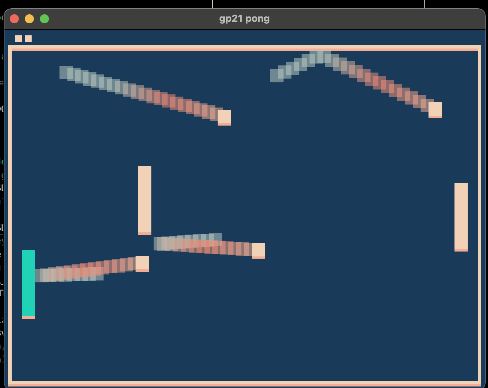

# TAKE COVERRR!!!

Author: Apoorv Gupta

Design: Dodge all of them ever increasing balls with your teal paddle, while hiding behind cover (another paddle). Five lives to spare and balls become faster as time passes, how long can you survive?

Screen Shot:

How To Play:
- Player paddle is teal.
- Hide behind the paddle in front of the player paddle, that's the player's cover.
- Lives are displayed on the top left corner.
- The balls keep increasing so stay alert to dodge them all.
- The ball trails are really useful for predicting
- Be alert of balls that bounce behind the cover paddle, they are dangerous.
- Final survival time score is displayed on the console

Sources: Not-pong base game

This game was built with [NEST](NEST.md).
